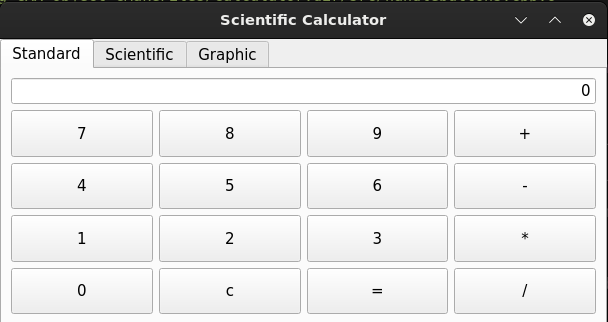
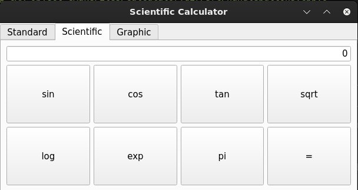
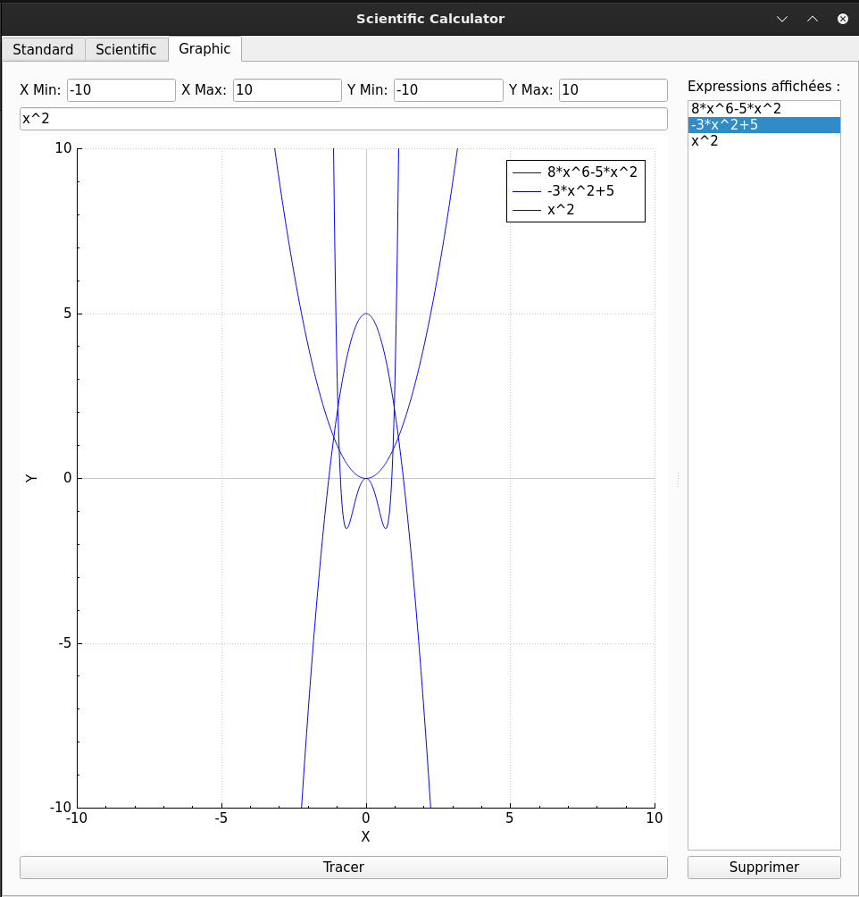

# Qt Calculator

**Description :**  
Qt Calculator est une application graphique développée en **C++** avec **Qt**, offrant une interface intuitive pour effectuer des calculs basiques et avancés. Le projet inclut des fonctionnalités supplémentaires telles que le calcul scientifique, un résolveur d'équations, et un générateur de graphiques.

---

## **Fonctionnalités**

- 🟢 **Calculs basiques** : Addition, soustraction, multiplication, division.
- 🟢 **Opérations scientifiques** : Trigonométrie, logarithmes, puissance, etc.
- 🟢 **Générateur de graphiques** : Affiche le graphe d'une expression mathématique donnée.

---

## **Installation et Compilation**

### Pré-requis
- **Qt 5** ou ultérieur.
- Un compilateur C++ compatible.
- Outils de développement Qt (qmake, make).

### Usage
   ```
   cd Qt-graph-calculator
   mkdir build
   cd build
   cmake ..
   make
   ./Calculator
   ```

<p align="center">
  
  
</p>


